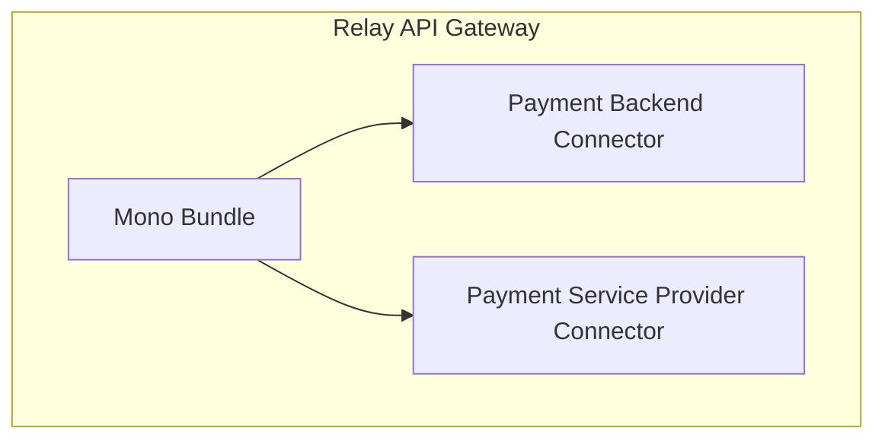

# Overview

Source: https://github.com/digital-blueprint/relay-mono-bundle

To provide user/customer information for starting a payment and for storing the
payment result you need one or more PB (Payment Backend) connectors. On the
other side you need at least one PSP (Payment Service Provider) connector which
is responsible for carrying out the payment. The main mono bundles allows you to
connect PBs and PSPs and configure them as payment types with different payment
methods which can be used via the HTTP API.

We currently provide the following PB connectors:

* [CAMPUSOnline Connector](../mono-connector-campusonline/index.md): For paying tuition fees
* [Generic Connector](../mono-connector-generic/index.md): For other services which
  implement the generic interface

We currently provide the following PSP connectors:

* [PayUnity Connector](../mono-connector-payunity/index.md): For processing the payment
  via https://www.payunity.com

You can find more information about each specific connector in their respective
bundle documentation.

## Installation Requirements

* A MySQL compatible database

## Documentation

* [Logging](./logging.md)
* [Configuration](./config.md)
* [Miscellaneous](./misc.md)
