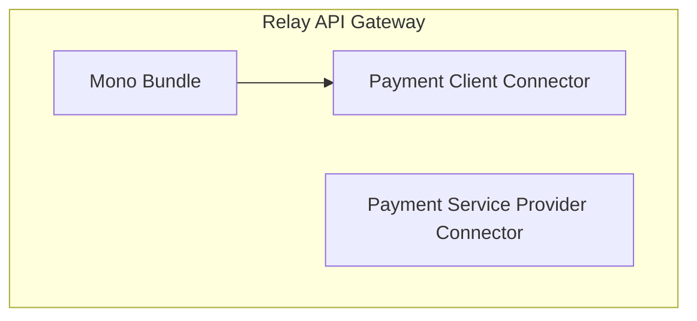

# Overview

Source: https://github.com/digital-blueprint/relay-mono-bundle

To provide user/customer information for starting a payment and for storing the
payment result you need one or more PC (Payment Client) connector. On the other
side you need at least one PSP (Payment Service Provider) connector which is
responsible for carrying out the payment. The main mono bundles allows you to
connect PCs and PSPs and configure them as payment types which can be used via
the HTTP API.

We currently provide the following PC connectors:

* [CAMPUSOnline Connector](../mono-connector-campusonline): For paying tuition fees
* [Generic Connector](../mono-connector-generic): For other services which
  implement the generic interface

We currently provide the following PSP connectors:

* [PayUnity Connector](../mono-connector-payunity): For processing the payment
  via https://www.payunity.com

You can find more information about each specific client connector in their
respective bundle documentation.

## Installation Requirements

* A SQL database like MySQL, PostgreSQL or similar.

## Documentation

* [Logging](./logging.md)
* [Configuration](./config.md)
