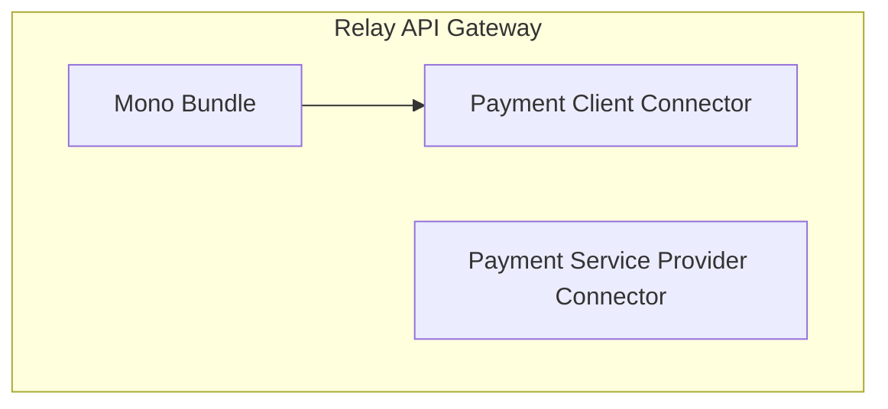

# Overview

Source: https://github.com/digital-blueprint/relay-mono-bundle



To provide user/customer information for starting a payment and for storing the
payment result you need one or more PC (Payment Client) connector. On the other
side you need at least one PSP (Payment Service Provider) connector which is
responsible for carrying out the payment. The main mono bundles allows you to
connect PCs and PSPs and configure them as payment types which can be used via
the HTTP API.

We currently provide the following PC connectors:

* [CAMPUSOnline Connector](../mono-connector-campusonline): For paying tuition fees
* [Generic Connector](../mono-connector-generic): For other services which
  implement the generic interface

We currently provide the following PSP connectors:

* [PayUnity Connector](../mono-connector-payunity): For processing the payment
  via https://www.payunity.com

You can find more information about each specific client connector in their
respective bundle documentation.

## Installation Requirements

* A SQL database like MySQL, PostgreSQL or similar.

## Configuration

Created via `./bin/console config:dump-reference DbpRelayMonoBundle | sed '/^$/d'`

```yaml
# Default configuration for "DbpRelayMonoBundle"
dbp_relay_mono:
    database_url:         '%env(resolve:DATABASE_URL)%' # Required
    payment_session_timeout: 1800 # Required
    payment_types:        # Required
        # Prototype
        -
            service:              ~ # Required
            auth_required:        false
            return_url_override:  ''
            return_url_expression: ''
            notify_url_expression: ''
            psp_return_url_expression: ''
            data_protection_declaration_url: ~
            recipient:            ~
            payment_contracts:    # Required
                # Prototype
                -
                    service:              ~ # Required
                    conditions:           ~
                    payment_methods:      # Required
                        # Prototype
                        -
                            identifier:           ~
                            name:                 ~
                            image:                ~
```

* `database_url` - A DSN for a database. The database is used to store
  information regarding active payment processes.
* `payment_session_timeout` - Time in seconds after which a created payment can
  no longer be continued.
* `payment_types` - A list of payment type configurations. A payment type is a
  combination of a payment client configuration and a payment service provider
  configuration.
    * `service` - The payment client service class
    * `auth_required` - If starting the payment process requires the client to be authenticated
    * `return_url_override` - An URL to which to redirect the user to after the
      process is finished. This overrides any return URL passed by the payment
      initiator.
    * `return_url_expression` - A Symfony expression for validating the return
      url provided by the initiator. Should return true if the URL is valid. If
      not given then all URLs are allowed.
    * `notify_url_expression` - ???
    * `psp_return_url_expression` - ???
    * `data_protection_declaration_url` - ???
    * `recipient` - The name of the payment recipient. Will be shown to the user.
    * `payment_contracts` - ???
        * `service` - The service provider service class
        * `conditions` - ???
        * `payment_methods` - ???
            * `identifier` - ???
            * `name` - ???
            * `image` - ???

## Documentation

* [Logging](./logging.md)
