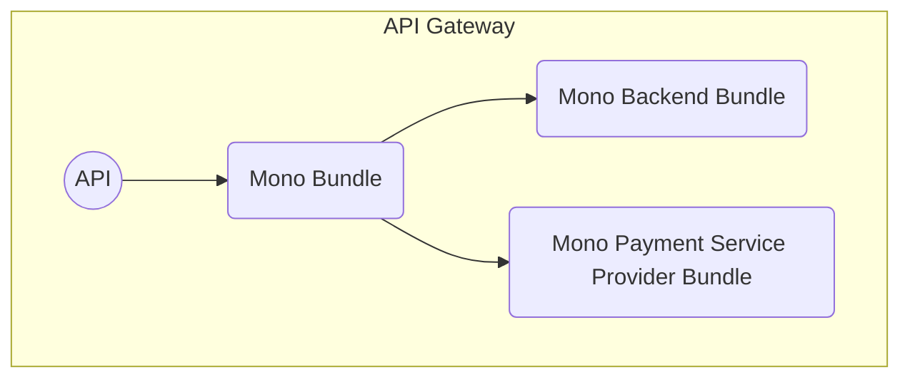

# Overview

Source: https://gitlab.tugraz.at/dbp/mono/dbp-relay-mono-bundle



## Installation Requirements

* A SQL database like MySQL, PostgreSQL or similar.

## Configuration

Created via `./bin/console config:dump-reference DbpRelayMonoBundle | sed '/^$/d'`

```
# Default configuration for "DbpRelayMonoBundle"
dbp_relay_mono:
    database_url:         '%env(resolve:DATABASE_URL)%' # Required
    payment_session_timeout: 1800 # Required
    payment_session_number_of_uses: 3 # Required
    payment_types:        # Required
        # Prototype
        -
            service:              ~ # Required
            auth_required:        false
            return_url_override:  ''
            return_url_expression: ''
            notify_url_expression: ''
            psp_return_url_expression: ''
            data_protection_declaration_url: ~
            recipient:            ~
            payment_contracts:    # Required
                # Prototype
                -
                    service:              ~ # Required
                    conditions:           ~
                    payment_methods:      # Required
                        # Prototype
                        -
                            identifier:           ~
                            name:                 ~
                            image:                ~
```

* `database_url` - A DSN for a database. The database is used to store
  information regarding active payment processes.
* `payment_session_timeout` - Timeout from when the payment was created in
  seconds. After the timeout has passed users can no longer start the payment.
  Already started payments will be completed after the timeout.
* `payment_session_number_of_uses` - ???
* `payment_types` - A list of payment type configurations. A payment type is a
  combination of a payment backend configuration and a payment service provider
  configuration.
    * `service` - The backend service class
    * `auth_required` - If starting the payment process requires the client to be authenticated
    * `return_url_override` - An URL to which to redirect the user to after the
      process is finished. This overrides any return URL passed by the payment
      initiator.
    * `return_url_expression` - A Symfony expression for validating the return
      url provided by the initiator. Should return true if the URL is valid. If
      not given then all URLs are allowed.
    * `notify_url_expression` - ???
    * `psp_return_url_expression` - ???
    * `data_protection_declaration_url` - ???
    * `recipient` - The name of the payment recipient. Will be shown to the user.
    * `payment_contracts` - ???
        * `service` - The service provider service class
        * `conditions` - ???
        * `payment_methods` - ???
            * `identifier` - ???
            * `name` - ???
            * `image` - ???

## Error Codes

* `mono:unknown-payment-type`: The referenced payment type isn't configured
