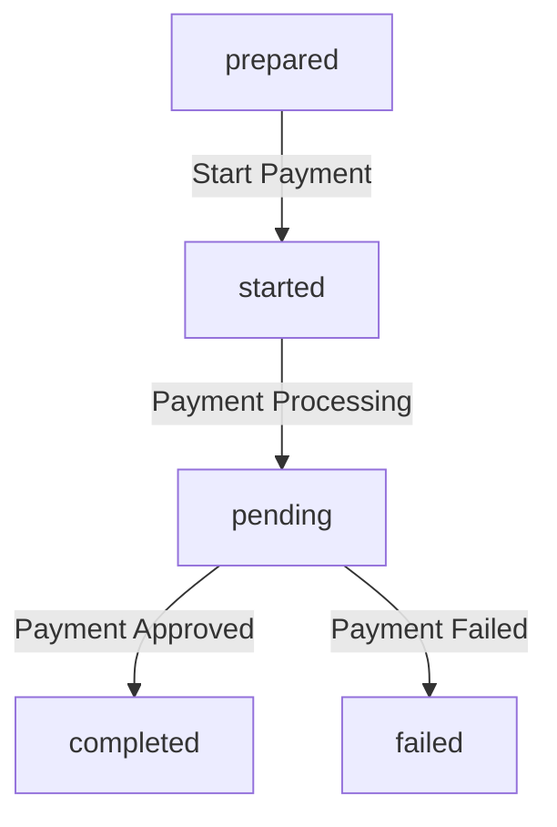

# Miscellaneous

## Database Migration

This bundle uses a database and requires migrations to be run after installation and on updates:

```bash
php bin/console dbp:relay:core:migrate
```

## CLI Commands

```bash
# Send reports to a custom email address foo@bar.com
./bin/console dbp:relay:mono:reporting --email foo@bar.com
```


## Payment Status


